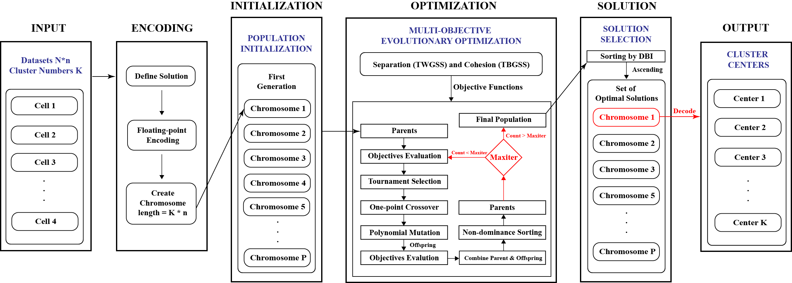

# Tutorial: Multi-Objective Genetic Algorithm for Cluster Analysis 

This package aims to cluster single-cell RNA sequencing transcriptomes using multi-objective genetic algorithm.

The tutorial is arranged as follows:
1. Dependency requirements
2. Data Preparation
3. Test demo

## Dependency requirements
The scripts are written in R and Python. In R, the following packages are needed: matrix, splatter, scater, scrnabench, and aricode. In python, the following packages are needed: scanpy, numpy, pandas, deap, scipy, sklearn, scoop, numba, umap.umap_, validclust, seaborn, and matplotlib. 

Please make sure your R version >= 4.0 and all packages are up to date.

## Data Preparation
Data are generated and preprocessed in R. To generate data, please, create a directory called 'data'. If you are in "./scripts", please execute the followings.
```
mkdir ../data
cd ../data
```

To generate the datasets, please make sure your initial current working directory is always in "data".

### scRNA-seq reference datesets
To generate scRNA-seq reference datesets for internal validation, please execute the following commands in "./data":

```
mkdir scrna_benchmarks_umap
Rscript ../scripts/generate_scrnaseq_reference.R
```

### scRNA-seq synthetic datasets
To generate scRNA-seq synthetic datasets for external validation, please execute the following commands in "./data":

```
mkdir synthetic_datasets
Rscript ../scripts/generate_scrnaseq_synthetic.R
```

### scRNA-seq reference datesets under perturbations
To generate scRNA-seq reference datasets for metamorphic testing, please execute the following commands in "./data":
```
mkdir metamorphic_test
cd metamorphic_test
mkdir 1 2 3 4 5 6
cd ..
Rscript ../scripts/generate_metamorphic_datasets.R
```

## Test Demo
Three sample executions files are provided in "./scripts". 

All experiments related to Seurat clustering are implemented in R, and other algorithms are implemented in Python. If you are interested how the algorithms are implemented, please look at "./scripts/clusterer.py". 

Before running the testing demo, please generate output directory by the following command if you are in "./scripts".
```
mkdir ../output
```

To run Seurat clustering for internal validation. Please execute the following command in "./scripts". The labels computed by Seurat for external validation are generated when creating synthetic datasets. Please check the labels file.
```
mkdir ../output/seraut_clustering
Rscript test_clustering_seurat.R 1
```

Metamorphic testing in Seurat uses a different workflow. Please execute the following command in "./scripts".
```
Rscript test_metamorphic_seurat.R 1
```

To run MOGA, SOGA, Kmeans, and Scanpy for clustering. Please execute the following command in "./scripts". The example presented is internal validation, and user can change the code with different input data to perform external validation and metamorphic testing.
```
python3 test_scrnaseq_benchmarks.py
```

## Citation
To cite this work:
'''
 @article{Zhao_Grayson_Khuri_2023,
  title={Multi-Objective Genetic Algorithm for Cluster Analysis of Single-Cell Transcriptomes}, 
  volume={13}, rights={http://creativecommons.org/licenses/by/3.0/}, 
  ISSN={2075-4426}, 
  url={https://www.mdpi.com/2075-4426/13/2/183}, 
  DOI={10.3390/jpm13020183},
  number={22}, 
  journal={Journal of Personalized Medicine}, 
  publisher={Multidisciplinary Digital Publishing Institute}, 
  author={Zhao, Konghao and Grayson, Jason M. and Khuri, Natalia}, 
  year={2023}, 
  month={Feb}, 
  pages={183}, 
  language={en} }
'''